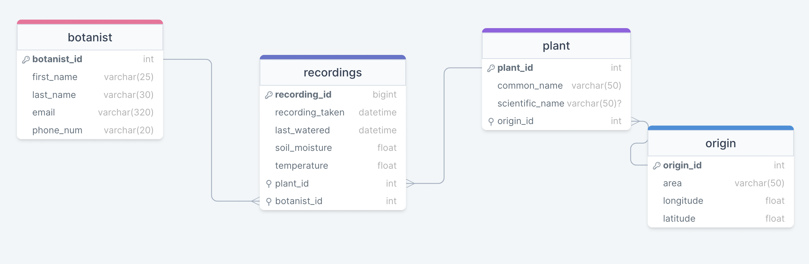

# Delta LNHM Plant Project

## Description

> This Project is responsible for the monitoring of plants housed within the conservatory of the Liverpool Natural
> History Museum (LNHM).

## Stakeholder Requirements

- `Monitor the health of the plants over time`
- `Alert Gardeners when there is a problem`

### Deliverables

- Full data pipeline, hosted in the cloud.
- Short-term database solution that can store the data for the past 24 hours.
- Long-term storage solution for all data older than 24 hours.
- Visualisation of the data.

### Dashboard Requirements

The requirements are:

- To be able to view the data in real-time.
- View graphs of the latest temperature and moisture readings for every plant.
- To be able to view the data from the long-term storage.

## Requirements

### Pre-requisites

- Python 3.11
- pip3
- sqlcmd
- AWS CLI
- Docker
- Terraform

### Imports

 ```sh
   pip3 install -r requirements.txt
   ```

**Secrets/Authentication**
> [!IMPORTANT]  
> To be able to run these scripts locally the following details must be provided in the `.env` file.

- `AWS_ACCESS_KEY_ID`
- `AWS_SECRET_ACCESS_KEY`
- `DB_HOST`
- `DB_PORT`
- `DB_USER`
- `DB_PASSWORD`
- `DB_NAME`
- `SCHEMA`
- `storage_folder`

## Deployment

- Run the following command to deploy the project:
  ```sh
  cd terraform
  terraform init
  terraform apply
  ```

## Files and Folder Structure Explained

- root folder: Contains the following files:
    - `.gitignore`: Contains the files that should be ignored by git.
    - `plant-sensor-erd.png`: Contains the ERD diagram of the project.
    - `plant-sensor.drawio.png`: Contains the architecture diagram of the project.
    - `README.md`: Contains the documentation of the project.
- .github folder: Contains code related to the github actions.
- dashboard folder: Contains code related to the dashboard.
    - Explained in the README.md file in the dashboard folder.
- pipeline folder: Contains code and resources related to the pipeline.
    - `main.py`: Contains the main logic code to run the pipeline.
    - `extract.py`: Contains the code to extract the data from the API.
    - `transform.py`: Contains the code to transform the data.
    - `load.py`: Contains the code to load the data into the database (short-term storage).
    - `test_extract.py`: Contains the test cases for the extract.py file.
    - `test_transform.py`: Contains the test cases for the transform.py file.
    - `test_load.py`: Contains the test cases for the load.py file.
    - `schema.sql`: Contains the schema of the database.
    - `requirements.txt`: Contains the required libraries to run the code.
    - `Dockerfile`: Contains the code to build the docker image.
    - `alter.py`: Contains the code to allow AWS to send alters.
- terraform folder: Contains code and resources related to the terraform.
    - `main.tf`, `dashboard-esc.tf`, `pipeline-lamdba.tf`, `pipeline-schedule`, `s3-bucket.tf`, `transfer-lambda.tf`, `transfer-schedule.tf` :
      Contain the code to create the resources in AWS.
    - `variables.tf`: Contains the variables used in the terraform code.
- transfer folder: Contains code and resources related to transferring data from the short-term storage to the long-term
  storage.
    - `Dockerfile`: Contains the code to build the docker image.
    - `transfer.py`: Contains the main logic code to transfer data from the short-term storage to the long-term storage.
    - `requirements.txt`: Contains the required libraries to run the code.
    - `test_transfer.py`: Contains the test cases for the transfer.py file.

## ERD


[ERD Diagram drawsql](https://drawsql.app/teams/shindy/diagrams/plant-sensors)

## Architecture Diagram


[Architecture Diagram Draw.io](https://drive.google.com/file/d/1Nsyt_0f5EQxFlBw96zSqF63O9sbwYiOd/view?usp=sharing)

## Maintainers

* [shindym](https://github.com/shindym)
* [aribasyeda](https://github.com/aribasyeda)
* [luciegamby-sigmalabs](https://github.com/luciegamby-sigmalabs)

