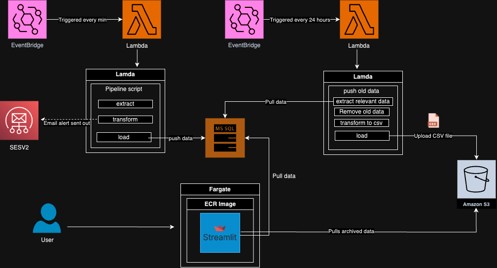

# c10-lnmh-plant-sensors
## Description
>This Project is responsible for the monitoring of plants housed within the conservatory of the Liverpool Natural History Museum (LNHM).

## Stakeholder Requirements
- `Monitor the health of the plants over time`
- `Alert Gardeners when there is a problem`

### Deliverables
- Full data pipeline, hosted in the cloud.
- Short term database solution that can store the data for the past 24 hours.
- Long term storage solution for all data older than 24 hours
- visualisation of the data.

## Requirements

### Pre-requisites
- Python 3.11
- pip3
- AWS CLI
- Docker
- Terraform
### Imports
 ```sh
   pip3 install -r requirements.txt
   ```

**Secrets/Authentication**
> [!IMPORTANT]  
> To be able to run these scripts locally the following details must be provided in the `.env` file.

| KEY |FILE REQUIRED|
| -------- | --------|

## Deployment

## Files

## ERD

## Architecture Diagram 

[Architecture Diagram Draw.io](https://drive.google.com/file/d/1Nsyt_0f5EQxFlBw96zSqF63O9sbwYiOd/view?usp=sharing)

## Maintainers
* [shindym](https://github.com/shindym)
* [aribasyeda](https://github.com/aribasyeda)
* [luciegamby-sigmalabs](https://github.com/luciegamby-sigmalabs)

